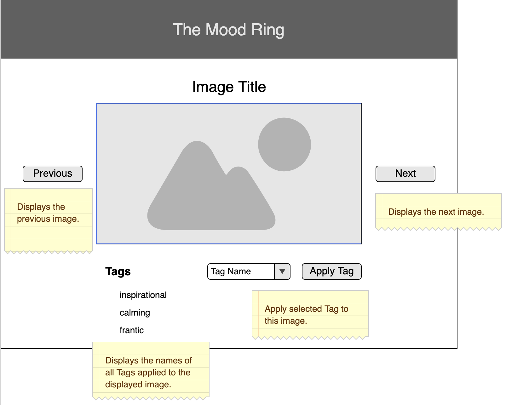
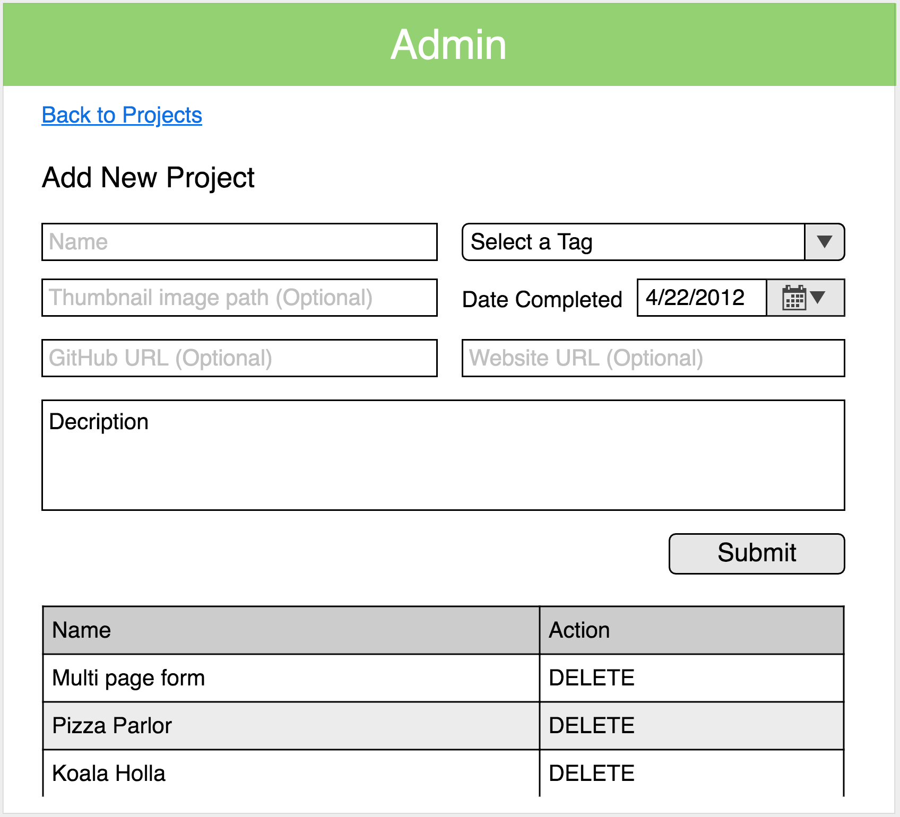

# React Redux with Sagas

For this weekend challenge, you'll be building mindfulness application: an image carousel tagging app!  

## Setup

> **PLEASE COMMENT YOUR CODE.** Do not clone this repository. Instead, download the zip, extract the contents, `git init`, `git add .`, `git commit -m "initial commit - base project"` and add your remote. Please do this before you leave for the day.

1. Create a database named `saga_weekend`
1. Run the following SQL using the `saga_weekend` database:

```SQL
CREATE TABLE "tags" (
    "id" SERIAL PRIMARY KEY,
    "name" varchar(255) NOT NULL
);

CREATE TABLE "projects" (
    "id" SERIAL PRIMARY KEY,
    "name" varchar(255) NOT NULL,
    "description" varchar(2048),
    "thumbnail" varchar(2048), 
    "website" varchar(2048),
    "github" varchar(2048),
    "date_completed" date,
    "tag_id" INT REFERENCES "tags"
);

INSERT INTO "tags" ("name") 
VALUES ('React'), ('jQuery'), ('Node'), ('SQL'), ('Redux'), ('HTML');
```

1. `npm install`
1. `npm run server`
1. `npm run client`

## Notes

### Tags

We've given you some starter tags in the database. Feel free to change or add some with Postico.
 
 ### Images
 We've added some abstract images in the `public/images` folder, and the database is set up to use them.

 ### Relationship
 Tags can be used by many different images.
 Images can have multiple tags.

 

**Do not implement image upload for base mode.**


## Feature List

> NOTE: Start by taking inventory of the existing code. Part of the work for setting up sagas has been done for you.


### Carousel

** DO NOT USE ANY PREBUILT CAROUSEL NOR CAROUSEL-ISH THING ** 
You can build this! Other components from Material-UI are fine.

- [ ] Client side route that displays a single image at a time, using data from database.
- [ ] Each image should have an ability to cycle through to the next/previous image. 
- [ ] With each image, users should be able to assign tags to the current image and save in the database. For base mode, duplicate tags are fine.
- [ ] Use Sagas for API requests to your server
- [ ] 

### Admin Page

- [ ] Client side route that displays a form allowing you to add a new project to your portfolio
- [ ] Include a drop down menu with a list of tags
- [ ] Send data to the server and notify the user of success or failure
- [ ] List projects by name and allow the user to delete them
- [ ] Include a button that navigates to the project page

### General Tasks

- [ ] Commit your code frequently! You should have at 15+ commits on a project of this size. Use branches to help break down your features.
- [ ] Comment your code.
- [ ] Update this README to include a description of the project in your own words.

## Wireframes

> NOTE: Feel free to modify the styling and layout of content on the page. 

### Project Page




### Admin Page



## Stretch Goals

- [ ] Give each tag associated to an image a different color
- [ ] Improve styling on the page using Material UI
- [ ] Create a view that can pull statistics 
- [ ] Implement additional features of the GitHub API
